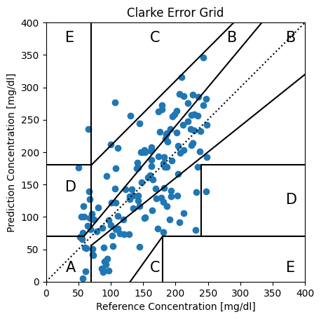

# ClarkeErrorGrid
This repository present python code to generate Clarke Error Grids in python with `matplotlib`.

## Repository structure
* All the code to generate Clarke Error Grids and assess where the data lies is located in `ClarkeErrorGrid.py`.
* Exemples of how to use the functions in `ClarkeErrorGrid.py` can be found in `example.ipynb`.

## Context

The Clarke Error Grid is a graphical tool used in diabetes management to assess the clinical accuracy of blood glucose monitoring systems (see fig. [^grids]). It consists of a grid that compares measured blood glucose values to reference values. The grid is divided into 5 zones, each representing a different level of clinical significance in terms of treatment decisions.

- **Zone A - Clinically Accurate:** This zone holds the values that differ from the reference values no more than 20 percent or the values in the hypoglycemic range (<70 mg/dl).
- **Zone B - Clinically Acceptable:** This zone holds values that differ more than 20 percent but would lead to no treatment errors.
- **Zone C - Over-correcting:** The real BG levels are outside of the acceptable levels while the predictions lie within the acceptable range.
- **Zone D - Failure to Detect:** The real BG levels are outside of the acceptable levels while the predictions lie within the acceptable range.
- **Zone E - Erroneous treatment:** Prediction values are opposite to actual BG levels, and treatment would aggravate the condition.

## Credits

### Contributors: 
The python source code was originally created by [Trevor Tsue](https://github.com/suetAndTie), and modified by [David Gerard](https://github.com/David-GERARD).

This work is based on the Matlab Clarke Error Grid Analysis File Version 1.2 by: Edgar Guevara Codina codina@REMOVETHIScactus.iico.uaslp.mx March 29 2013, Copyright (c) 2008, Edgar Guevara Codina All rights reserved.

### References: 
* [1] Clarke, WL. (2005). "The Original Clarke Error Grid Analysis (EGA)." Diabetes Technology and Therapeutics 7(5), pp. 776-779. 
* [2] Maran, A. et al. (2002). "Continuous Subcutaneous Glucose Monitoring in Diabetic Patients" Diabetes Care, 25(2). 
* [3] Kovatchev, B.P. et al. (2004). "Evaluating the Accuracy of Continuous Glucose- Monitoring Sensors" Diabetes Care, 27(8). 
* [4] Guevara, E. and Gonzalez, F. J. (2008). Prediction of Glucose Concentration by Impedance Phase Measurements, in MEDICAL PHYSICS: Tenth Mexican Symposium on Medical Physics, Mexico City, Mexico, vol. 1032, pp. 259261. 
* [5] Guevara, E. and Gonzalez, F. J. (2010). Joint optical-electrical technique for noninvasive glucose monitoring, REVISTA MEXICANA DE FISICA, vol. 56, no. 5, pp. 430434.

Redistribution and use in source and binary forms, with or without 
modification, are permitted provided that the following conditions are 
met:

* Redistributions of source code must retain the above copyright 
notice, this list of conditions and the following disclaimer. 
* Redistributions in binary form must reproduce the above copyright 
notice, this list of conditions and the following disclaimer in 
the documentation and/or other materials provided with the distribution

THIS SOFTWARE IS PROVIDED BY THE COPYRIGHT HOLDERS AND CONTRIBUTORS "AS IS" 
AND ANY EXPRESS OR IMPLIED WARRANTIES, INCLUDING, BUT NOT LIMITED TO, THE 
IMPLIED WARRANTIES OF MERCHANTABILITY AND FITNESS FOR A PARTICULAR PURPOSE 
ARE DISCLAIMED. IN NO EVENT SHALL THE COPYRIGHT OWNER OR CONTRIBUTORS BE 
LIABLE FOR ANY DIRECT, INDIRECT, INCIDENTAL, SPECIAL, EXEMPLARY, OR 
CONSEQUENTIAL DAMAGES (INCLUDING, BUT NOT LIMITED TO, PROCUREMENT OF 
SUBSTITUTE GOODS OR SERVICES; LOSS OF USE, DATA, OR PROFITS; OR BUSINESS 
INTERRUPTION) HOWEVER CAUSED AND ON ANY THEORY OF LIABILITY, WHETHER IN 
CONTRACT, STRICT LIABILITY, OR TORT (INCLUDING NEGLIGENCE OR OTHERWISE) 
ARISING IN ANY WAY OUT OF THE USE OF THIS SOFTWARE, EVEN IF ADVISED OF THE 
POSSIBILITY OF SUCH DAMAGE.
